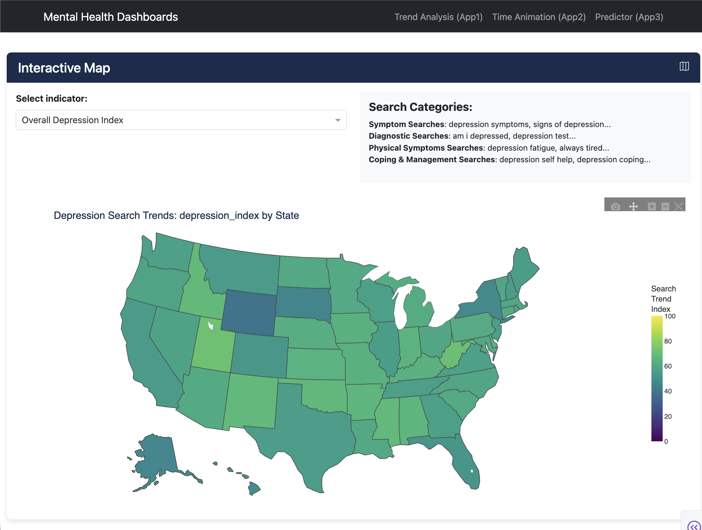

# GapSight Health

Mental Health Demand–Supply Gap Monitor (U.S.)

GapSight Health quantifies mental health demand signals (Google Trends) and contrasts them with provider capacity (HRSA/AHRF) to surface demand–supply gaps across U.S. states over time.

Demo: <https://mental-health-dashboard-iw4i.onrender.com/>

## Highlights

- 2020–2024 state–month dataset integrating Google Trends (400+ mental-health queries) + HRSA/AHRF provider-capacity metrics
- Interpretable modeling: XGBoost + SHAP to estimate anxiety/depression demand indices and surface top drivers
- Interactive dashboard to explore gaps and drivers by state and month



## Repo structure

- `app/` dashboard app
- `src/` data + modeling pipeline (in progress)
- `notebooks/` experiments / analysis
- `docs/` report and slides

## Quickstart (WIP)

```bash
pip install -r requirements.txt
python app/app.py

## Attribution / Credits

Personal continuation/refactor of a GWU Capstone team project (Team of 4).
Original team members: Erica Zhao, Qibin Huang, Jianjun Gao, Sandhya Karki.
Original team repo: [QibinHuang/Mental-Health-dashboard][team-repo]

[team-repo]: https://github.com/QibinHuang/Mental-Health-dashboard
```
